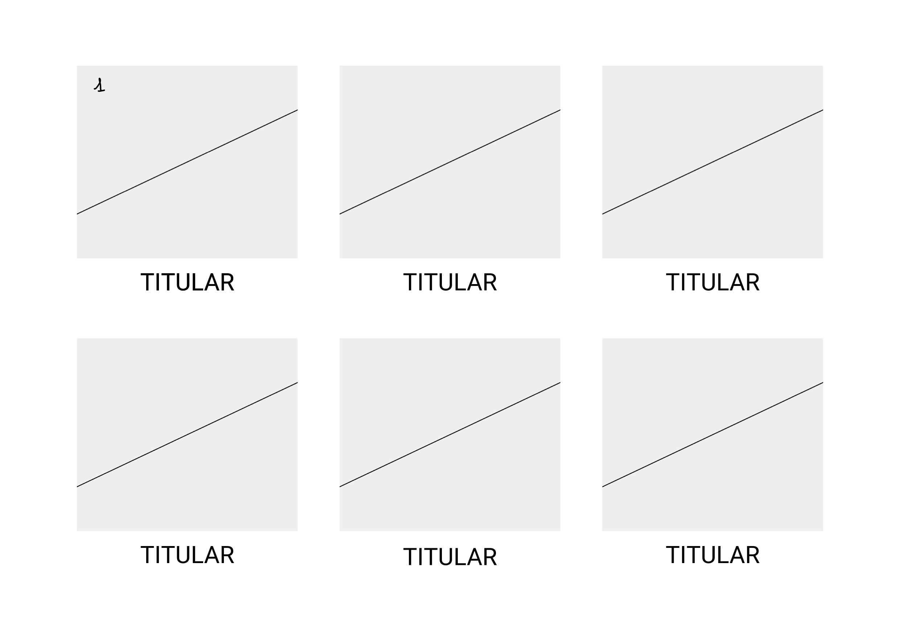
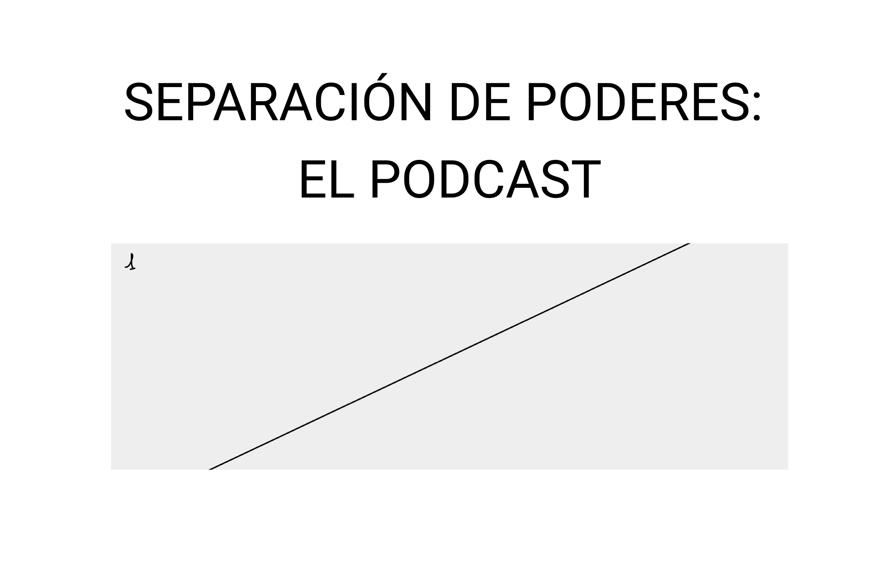
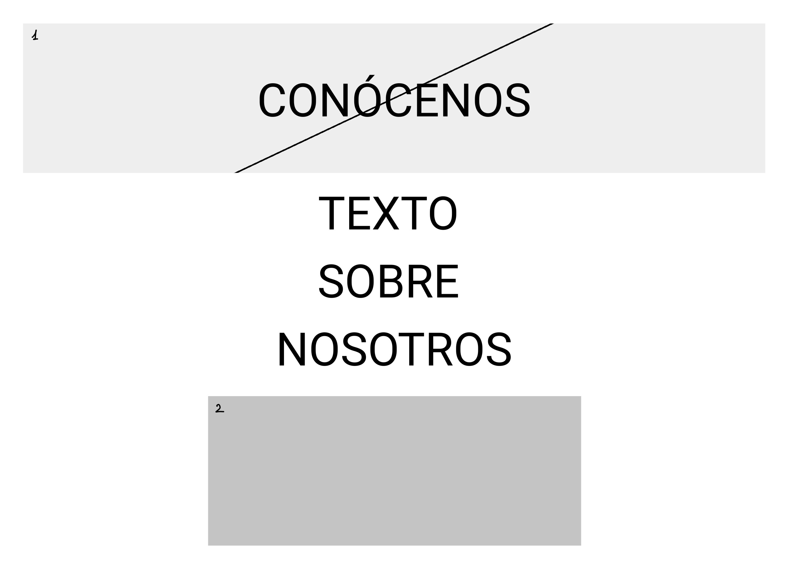
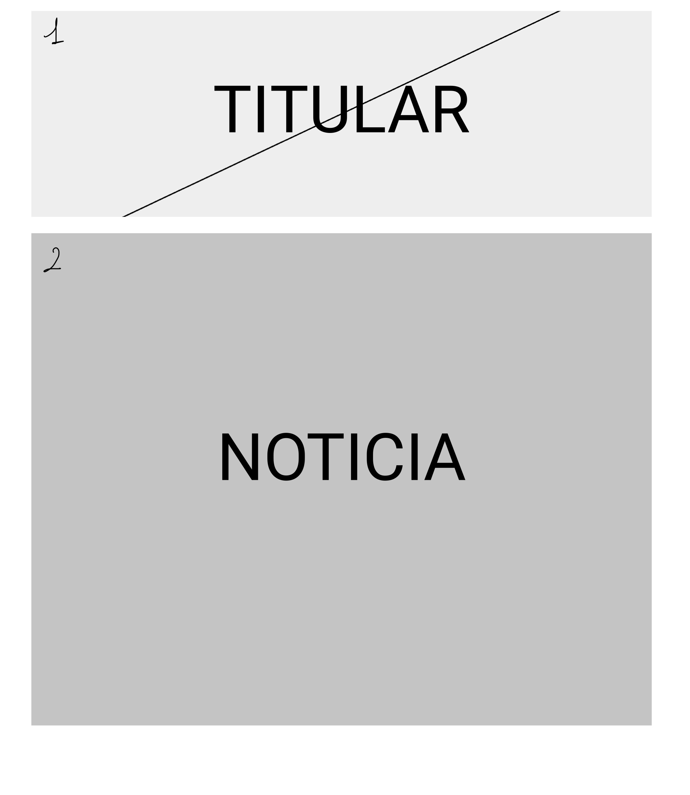

# Wireframes

<!--
Recoged en este documento un listado con enlaces a los diferentes
wireframes que creéis para el proyecto web
-->
Los wireframes se crean para poder realizar **una vista preliminar de la página web** antes de llevarla a cabo y publicarla. Pueden ser de varios tipos, desde un boceto a mano hasta algo más elaborado creado a través de una aplicación web. 

En nuestro caso, hemos decidido crearlo utilizando la página web y aplicación de escritorio [**Figma**](https://www.figma.com). Los resultados son los siguientes:

#### PÁGINA PRINCIPAL

Esta es la página principal. En ella, podemos encontrar el nombre del diario online sobrepuesto sobre un banner permanente (3), tres noticias de nuestro apartado casos (4) y un botón de “ver más” por si se desean conocer más noticias. 

La barra superior (5) y la barra inferior (6) van a aparecer en todas las páginas que vamos a mostrar a continuación. 

En la superior aparece el logo del diario (1), seguido de los botones de Casos, Opinión, Podcast y Sobre Nosotros, el botón LOG IN y su correspondiente foto de perfil (2, que se mostrará únicamente si estás conectado).

En la inferior aparece la manera parara suscribirse a nuestra *newsletter* y la marca de derechos reservados.            

#### PÁGINA DE CASOS/OPINIÓN

En esta página se pueden encontrar nuestras noticias y artículos de opinión. Este diseño es válido tanto para la página de Casos como la de Opinión. Los elementos que conforman esta página son la imagen correspondiente a la noticia (1) y su titular. 

#### PODCAST

La sección de podcast es muy sencilla: consta de la frase “Separación de poderes: el podcast” y a continuación un plugin reproductor con el último capítulo del podcast (1).

#### SOBRE NOSOTROS

Esta página comienza mostrando la frase “conócenos” (1) sobre una imagen de los redactores del periódico. A continuación, se muestra un pequeño texto escrito por los que conforman el diario, seguido de un formulario de contacto (2).

#### PÁGINA DE NOTICIA

Esta maqueta pertenece a una noticia cualquiera. Comienza con el titular de la misma sobre la imagen correspondiente a ella (1), y continúa con el propio cuerpo de la noticia (2). 

Finalmente, nos gustaría añadir que nuestra página web no constará de buscador. Las búsquedas se podrán realizar directamente desde buscadores como Google, Ecosia o DuckDuckGo. Nos gustaría crear una web acorde con la actualidad, y por ello nuestra prioridad es que nuestros lectores se centren en ella. Las noticias serán acompañadas de links que facilitarán la navegación dentro de la página. 
